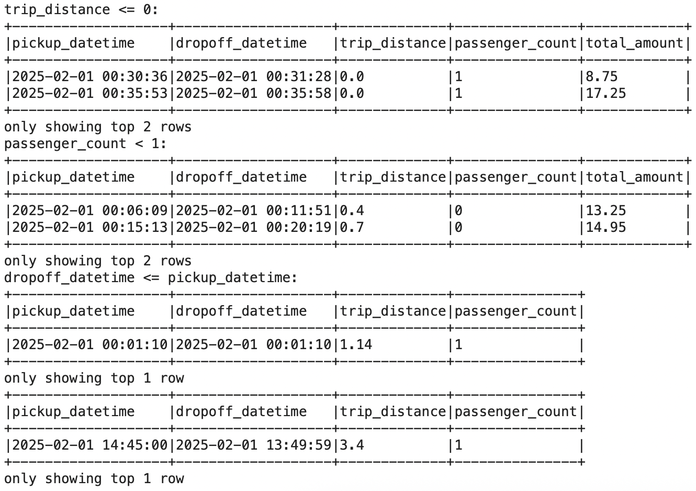

# BDM-Team

## Quick start

```docker compose up -d```

Then open: 

Jupyter: http://localhost:8888 — token: bdm <br>
Spark UI: http://localhost:4040 (available once a SparkSession is started)

```docker compose down   # when done```

## 1. Correctness
Our cleaning rules:
| # | Rule | Column(s) | Condition kept |
|---|------|-----------|---------------|
| 1 | Non-null timestamps | pickup_datetime, dropoff_datetime | isNotNull() |
| 2 | Chronological trip | both timestamps | dropoff > pickup |
| 3 | Positive distance | trip_distance | > 0 |
| 4 | Valid passenger count | passenger_count | > 0 |
| 5 | Positive fare | total_amount, fare_amount | > 0 |
| 6 | Valid location IDs | PULocationID, DOLocationID | isNotNull() |

#### Row counts: 
Rows input: 7052769 <br>
Rows after clean: 5472446(removed 1580323) <br>
Rows after dedup: 5472446( all removed during the cleaning step) <br>

#### 'Bad Rows' examples: 


### A Manifest File 
The manifest file can be found in the `state` folder (what is created on the first job).

Structure of the file: 
- `trip_files`: A list of trip data files that have been ingested.
    - `filename`: Name of the parquet file.
    - `file_size`: Size of the file in bytes at the time of ingestion. Used to detect duplicates or changes.
    - `processed_at`: Timestamp of when the file was processed.
- `lookup_loaded`: Boolean flag indicating if reference data (taxi zone lookup) has been loaded. Prevents reloading static data unnecessarily.

How It Works:
1. Check for New Files
    - The ETL job scans the data/inbox/ folder.
    - Files not listed in trip_files are considered new and read for processing.
2. Process and Clean
    - Only the new files are cleaned, cast to the proper schema, and appended to the final dataset.
3. Update Manifest
    - After processing, each new file’s metadata is added to trip_files.
    - If reference tables were loaded during this run, lookup_loaded is set to true.

## 2. Performance

## 3. Scenario
` Maintain data/outbox/monthly_borough_summary.parquet that is updated incrementally: on each run, compute stats only for newly ingested months and append to the summary. Do not recompute from the full dataset. README must explain the append strategy and how idempotency is preserved.`